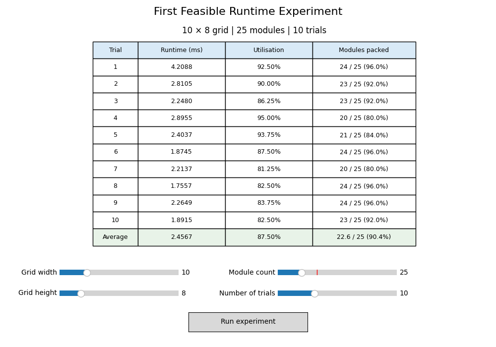

# 2D Bin Packing for Procedural Building Faces

## Research direction

The project began with an experiment using a classic continuous bin-packing
strategy: bottom-left placement. That implementation is contained in the
`cont_bin_packing` folder. It provided a useful starting point, but the target
use case required a more controlled relationship between the generated modules
and the geometry of a building face. A continuous solution could place shapes
at arbitrary coordinates, whereas the intended facade needed a discrete,
grid-based structure.

This led to the development of a discrete bin-packing system. The system was
designed around the following rules:

- Modules have fixed, permitted dimensions.
- Modules may only be placed on integer grid coordinates.
- The grid can have variable width and height.
- Every grid cell must be filled in the final representation.
- Requested modules must remain distinguishable from cells added only to
	complete the grid.

The discrete implementation is contained in the `disc_bin_packing` folder.
It includes module generation, grid occupancy management, packing algorithms,
and a Matplotlib visualiser for inspecting the results interactively.

## Choosing an algorithm

Several packing approaches were considered, including First Feasible,
MaxRects, and shelf-based packing. First Feasible was selected because it
offers a useful combination of efficiency, simplicity, and a uniformly chaotic
visual character. Those properties are valuable for procedural building-face
generation, where the result should feel varied without requiring an expensive
global optimisation process. Its simple control flow also makes it a plausible
candidate for implementation in Blender Geometry Nodes.

## First Feasible

First Feasible is order-dependent. For example, presenting modules in the order
`3×3 -> 2×2 -> 1×3` can produce a completely different packing from presenting
the same modules as `1×3 -> 3×3 -> 2×2`.

For each module, the algorithm scans the grid according to its configured
direction and immediately selects the first position where the module fits. It
does not compare all feasible positions or reconsider earlier placements in
order to improve the final result. The visualiser exposes six scan-order
variants:

- Bottom to Top, Left to Right
- Bottom to Top, Right to Left
- Top to Bottom, Left to Right
- Top to Bottom, Right to Left
- Left to Right, Bottom to Top
- Right to Left, Bottom to Top

The algorithm also has an application-specific completion step. The
`_fill_empty_cells()` method adds `1×1` filler modules to any cells that remain
empty after the requested modules have been processed. This completion step is
not inherently part of First Feasible; it was added because the building-face
use case requires a completely filled grid. Filler modules are marked with
`is_filler=True`, allowing them to be distinguished from the originally
generated modules when calculating utilisation and analysing the results.

## Visualisation and experimentation

The Matplotlib visualiser links the First Feasible algorithm to an interactive
grid representation. It allows the grid dimensions, module count, module-size
weights, and scan-order variant to be changed. The visualiser reports runtime,
requested module cells, filler cells, occupied cells, and utilisation. The
controls update the packing so the effect of each parameter can be inspected
without manually rebuilding the experiment.

The `stats_gen.py` script provides a separate quantitative experiment. It runs
multiple trials for a fixed grid and module count, then reports the runtime,
utilisation, and proportion of requested modules successfully packed for each
trial. It also generates scaling graphs for these measures as module count
changes.

## Visual evidence

The following renders show example outputs from the First Feasible visualiser:

The placement process can be viewed as an animation:

[First Feasible animation](disc_bin_packing/algorithms/First%20Feasible%20(Anim).mp4)

The scaling experiments produced the following graphs for a fixed 10 × 8 grid:

## Experimental observations

For the scaling experiments, the grid was fixed at 10 × 8 cells while the
target module count was varied.

### Utilisation

Utilisation initially increases as module count increases. This is expected:
more requested modules generally occupy more cells, so fewer filler modules
are needed to complete the grid. At a module count of approximately 40, the
grid was almost uniformly at 100% utilisation.

The trend eventually plateaus and can dip slightly. Once the grid becomes
dense, the order-dependent placements can create fragmented, unusable gaps.
Those gaps prevent later modules from fitting even when some total cell area
remains available. Filler modules still complete the physical grid, but they
are excluded from the useful-module utilisation measure.

### Runtime

Runtime follows a more linear increasing trend as module count increases. Each
additional requested module creates more placement work, and the algorithm
checks candidate positions until it finds a feasible one or exhausts the grid.
As the module count grows, the gradient of the runtime trend becomes less
uncertain. This suggests that latency becomes more predictable when the
algorithm has a larger and more consistent amount of work to perform.

### Successfully packed modules

The proportion of successfully packed modules shows a different pattern. At
low module counts it remains at 100%, because the grid has sufficient capacity
for all requested modules. Once a threshold module count is reached, the grid
cannot accommodate every request. The ratio of successfully packed modules to
the total requested modules then steadily decreases as additional requests
are made.

This result exposes the main limitation of First Feasible. Once the grid passes
its threshold, additional modules are increasingly likely to be rejected. The
algorithm does not revisit earlier decisions, so fragmentation can prevent a
later module from fitting even when enough total area might appear to remain.

## Suitability for Geometry Nodes

These results suggest that First Feasible is suitable for Blender Geometry
Nodes when speed, simplicity, and predictable behaviour matter more than
optimal packing.

Its main strengths are:

- It is simple to implement procedurally.
- It is fast enough for interactive generation and parameter changes.
- Its runtime becomes increasingly predictable as the workload grows.
- It naturally fills sparse regions with `1×1` filler modules.
- It produces valid, completely filled grid representations without an
	expensive global optimisation stage.
- Its order dependence creates variation that can be useful for stylised
	procedural facades.

However, it is less suitable when every requested module must be placed, when
material efficiency is important, or when the facade must satisfy strict
architectural constraints. For dense layouts, the output can depend strongly
on module order and scan direction, and the number of rejected modules can
become significant.

For this use case, First Feasible is therefore a strong candidate for
interactive and exploratory facade generation. A more powerful offline pass
could be added later for final production layouts. In the meantime, ordering
larger modules first, reserving regions for large modules, or comparing the
six scan directions can reduce fragmentation without giving up the algorithm's
speed and procedural simplicity.

